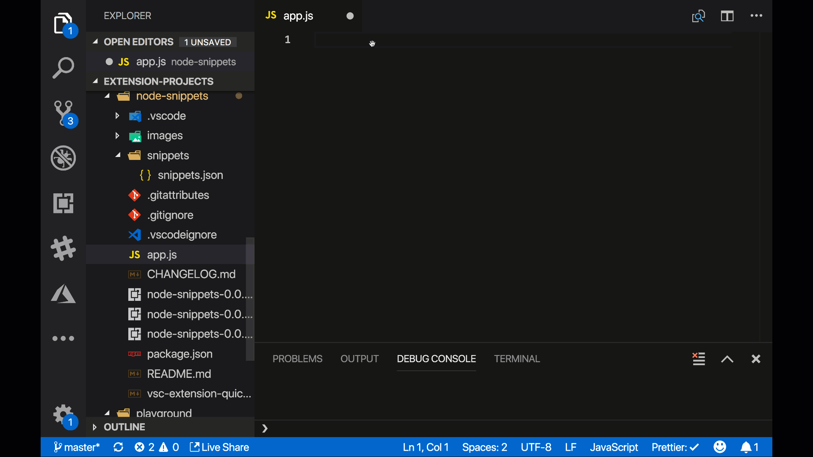

# node-snippets

This is an extension meant to give you some awesome NodeJS snippets


## Contact

If you find issues please report them on the GitHub repo.

If you have any comments like feature requests or feedback on theses snippets please contact me on Twitter at [chris_noring](https://twitter.com/chris_noring).

Remember these snippets are for all of you, so if you feel that they could be even better, don't hesitate to let me know :)

/Chris

## Features

A collection of NodeJS snippets

The following commands are available:

- `node-express`, creates an express server
- `node-express-get`, creates GET route
- `node-express-get-params`, creates a GET route and shows how to access parameters
- `node-express-post`, creates a POST route
- `node-express-post-params`, creates a POST route and shows how to access the body
- `node-express-post-params-alt`, creates a POST route, shows how to access the body, works for express 4.16 and above
- `node-express-put-params`, creates a PUT route, shows how to access body.
- `node-express-delete-params`, creates a DELETE route, shows how to access route parameter.
- `node-express-query-params`, creates a POST route, shows how to access query parameters.
- `node-express-middleware-logger`, creates an example middleware
- `node-express-middleware-error`, creates an error handling middleware
- `node-http-server`, creates a simple HTTP server
- `node-file-read-sync`, reads a file synchronously
- `node-file-read-async`, reads a file asynchronously, with a callback
- `node-event-emitter`, creates an event emitter, emit events and shows to subscribe to said event
- `node-promise-create`, creates a Promise
- `node-promise-shorthand`, creates a Promises using the static methods `resolve()` and `reject()`
- `node-promise-all`, resolves a list of Promises using the `Promise.all([])` method
- `node-async-await`, using async/await
- `node-express-schema-validation`, adding schema validation for express, read more about the usage of schema validation with `Joi` at https://github.com/hapijs/joi
- `node-regex-test-digits`, invokes the `test()` method that tests whether a string matches a regular expression on digits.
- `node-regex-test-word`, invokes the `test()` method that tests whether a string matches a regular expression on word boundaries.
- `node-regex-match`, invokes the method `match()` on a regular expression to find a file extension
- `node-regex-match-named-group`, invokes the method `match()` on a regular expression and place it in a group called `exteension`.
- `node-http-quark`, creates a HTTP app using the framework [quarkhttp](https://www.npmjs.com/package/quarkhttp),
- `node-http-quark-get`, adds a GET route to your [quarkhttp](https://www.npmjs.com/package/quarkhttp) app
- `node-http-quark-post`, adds a POST route to your [quarkhttp](https://www.npmjs.com/package/quarkhttp) app
- `node-http-quark-put`, adds a PUT route to your [quarkhttp](https://www.npmjs.com/package/quarkhttp) app
- `node-http-quark-middleware`, adds a middleware to your [quarkhttp](https://www.npmjs.com/package/quarkhttp) app
- `node-jest-suite`, adds a test suite
- `node-jest-test`, adds a test
- `node-jest-test-expect`, adds a test with an expect
- `node-jest-expect`, adds an expect, using `toBe()`
- `node-jest-expect-to-equal`, adds expect, using `toEqual()`
- `node-jest-test-expect-to-equal`, adds a test with an expect, using `toEqual()`
- `node-jest-expect-to-throw`, adds an expect, using `toThrow()`
- `node-jest-test-expect-to-throw`, adds a test with an expect, using `toThrow()`,
- `node-jest-test-beforeAll`, adds a `beforeAll()`, this method runs before all tests
- `node-jest-test-afterAll`, adds a `afterAll()`, this method runs after all tests
- `node-supertest-init`, adds the initial imports for supertest and the app you are about to test. I assume the app you are about to test looks something like this:

   ```javascript
   //  app.js
   const express = require('express')
   const app = express();
   // your route definitions
   module.exports = app;
   ```

   and that your file structure looks like this:

   ```bash
   -| app.js    // this is where the web app goes
   -| __tests__/
   ---| app.js  // this where the tests goes
   ```

- `node-supertest-beforeall`, configures supertest to use the app instance, this is a needed step to initialize supertest
- `node-supertest-aftereall`, ensures the web app closes down after the test run, this is a needed step.
- `node-supertest-testget`, an example of supertest testing a GET route
- `node-supertest-testgetwithparam`, an example of supertest testing a GET route with a route parameter
- `node-supertest-testpost`, an example of supertest testing a POST route with a payload

## Release Notes

This is the release notes.

### 1.3.2

Adding typescript support. Thank you to @DrQubit for the suggestion

### 1.2.1

Adding supertest so you can easily test your API. Assumes using Express as web framework.

### 1.1.0

Adding Jest snippets and snippets for a micro HTTP framework, quarkhttp (can be installed from NPM)

### 0.0.5

correcting the docs

### 0.0.4

adding schema validation with the lib `Joi`

### 0.0.3

added promises and async

### 0.0.2

added repo and icon

### 0.0.1

some initial commands for express library but also things like `http`, file access and using `event-emitter`

## Publisher

Chris Noring
@chris_noring
